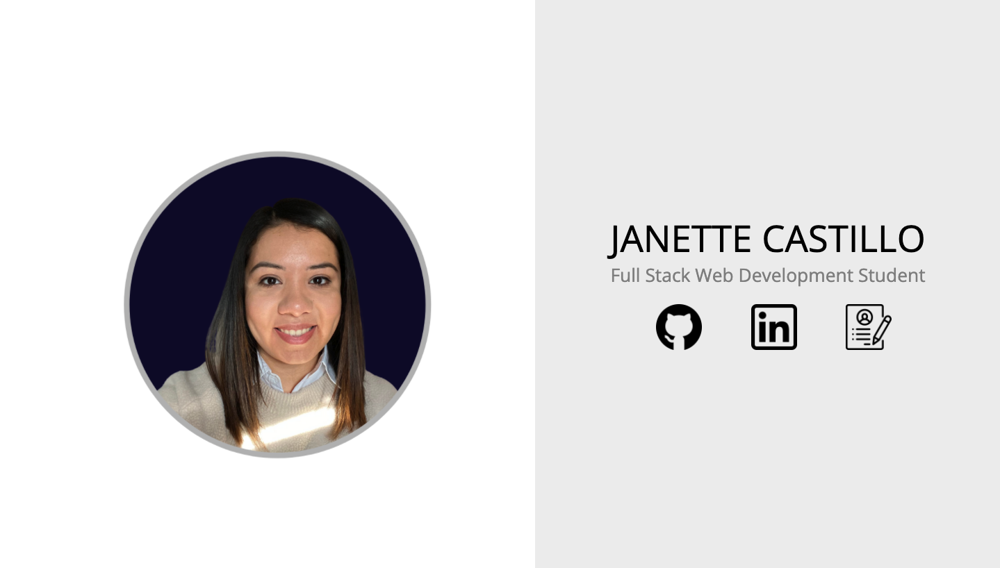
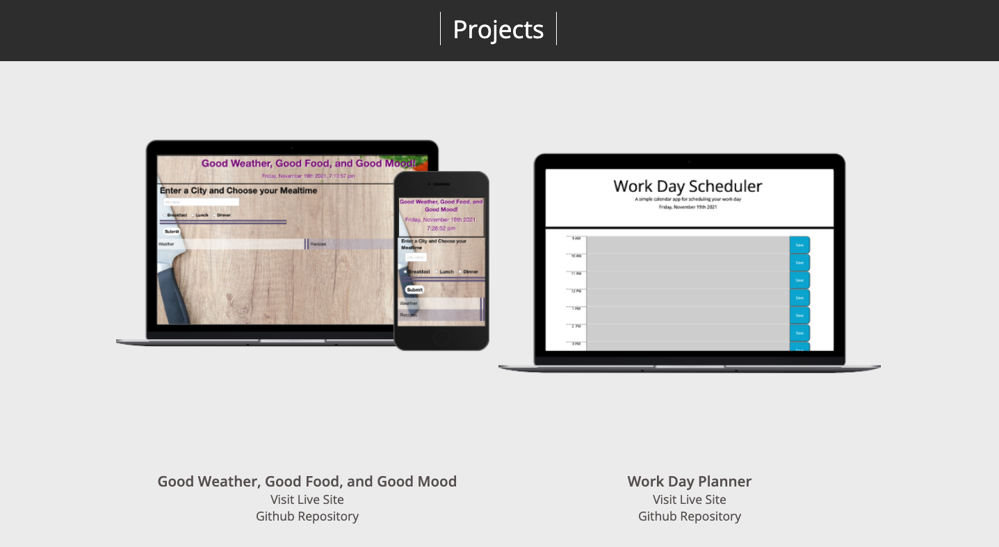
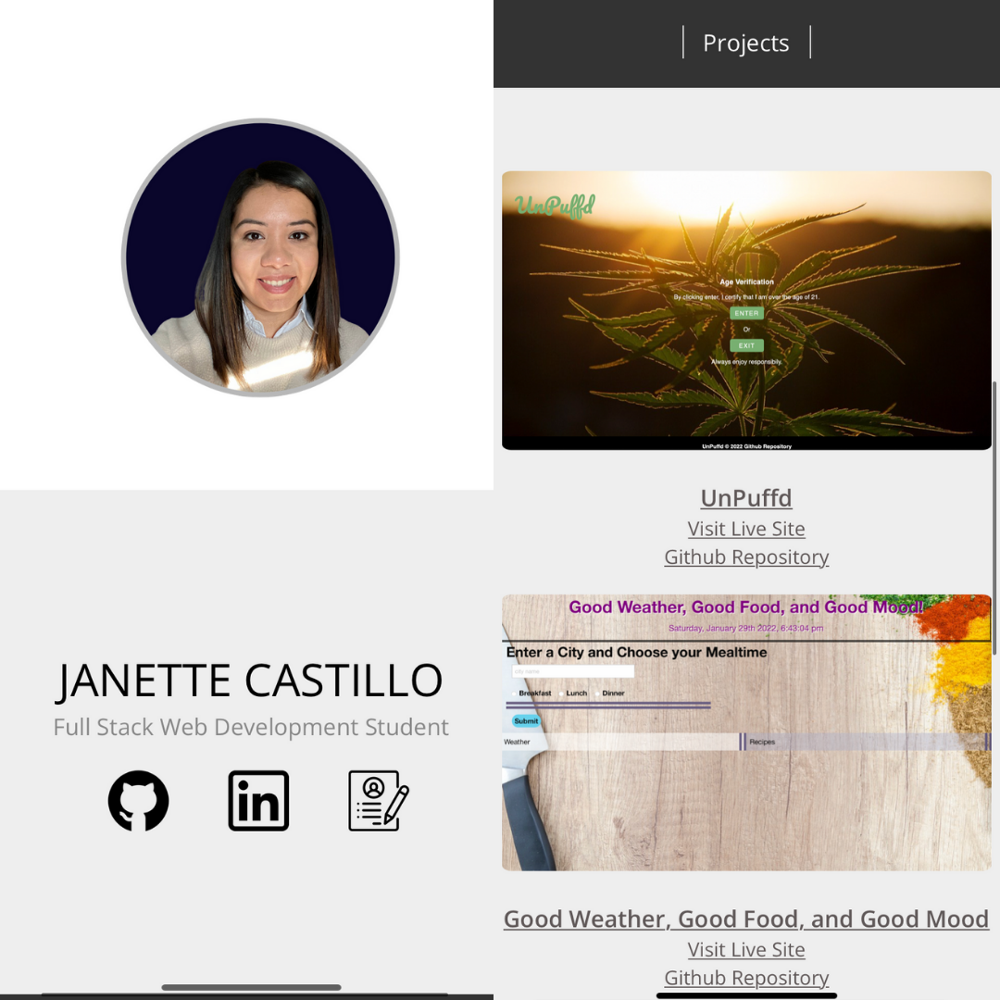

# portfolio-v3-

## Table of Contents
  * [User Story](#user-story)
  * [Acceptance Criteria](#acceptance-criteria)
  * [Technologies Used](#technologies-used)
  * [Installation](#installation)
  * [Questions](#questions)
  * [Credits](#credits)
  * [License](#license)
  * 
# User Story

As an employer, I want to view a potential employee's deployed portfolio of work samples. So I can review samples of their work and assess whether they're a good candidate for an open position.

## Acceptance Criteria

* GIVEN I need to sample a potential employee's previous work
* WHEN I load their portfolio
* THEN I am presented with the developer's name, a recent photo or avatar, and links to sections about them, their work, and how to contact them
* WHEN I click one of the links in the navigation
* THEN the UI scrolls to the corresponding section
* WHEN I click on the link to the section about their work
* THEN the UI scrolls to a section with titled images of the developer's applications
* WHEN I am presented with the developer's first application
* THEN that application's image should be larger in size than the others
* WHEN I click on the images of the applications
* THEN I am taken to that deployed application
* WHEN I resize the page or view the site on various screens and devices
* THEN I am presented with a responsive layout that adapts to my viewport

# Technologies Used
* HTML
* CSS
* Javascript
* Media Queries

# Installation
Run using the github URL: https://jcastillo9.github.io/portfolio-v3-/

Desktop

Mobile

## Questions:
 ### Reach me here:

  * Github: <https://github.com/jcastillo9>
  * Email: janette.castillo91@yahoo.com

## Credits
 
* Lead Developer - Janette Castillo (janette.castillo91@yahoo.com)
* Flat Icon - Icons used for Github, LinkedIn and Resume (www.flaticon.com)

# License
 
The MIT License (MIT)
